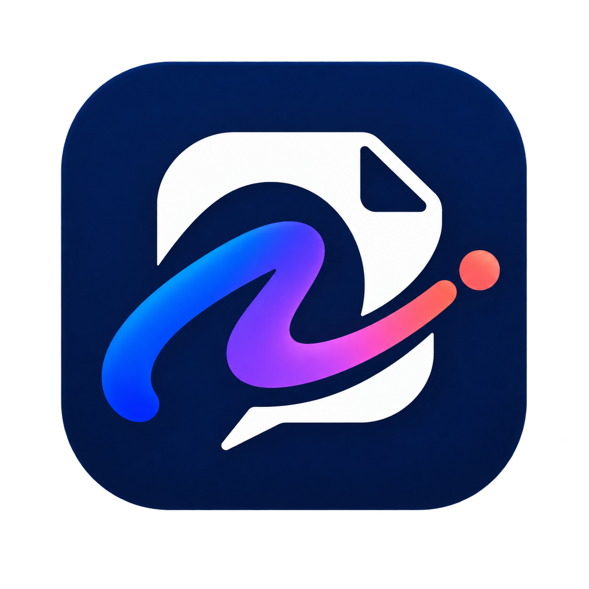

<p align="center">
  
</p>

# LinguaFlow

> **Mastery via Output** — 一套以「输出驱动」为核心的多语言沉浸式学习系统。

LinguaFlow 是一个**纯前端**的语言学习应用：用 AI 生成练习内容、陪你对话、纠正你的写作、把文字读给你听、还能听懂你的发音。它不追求「背多少单词」，而是逼你**真的去说、去写、去用**——因为语言只有在输出时才真正长在自己身上。

---

## 目录

- [这个项目能做什么](#这个项目能做什么)
- [支持的语言](#支持的语言)
- [核心功能（19 个模块）](#核心功能19-个模块)
- [AI 能力说明](#ai-能力说明)
- [技术栈](#技术栈)
- [品牌资源](#品牌资源)
- [快速开始](#快速开始)
- [如何获取 API Key](#如何获取-api-key)
- [项目结构](#项目结构)
- [配置项说明](#配置项说明)
- [已知限制与常见问题](#已知限制与常见问题)
- [开源与贡献](#开源与贡献)

---

## 这个项目能做什么

LinguaFlow 围绕一个理念设计：**你学得最好的语言，是你用得最多的语言。** 所以应用里没有传统课本式的单选填空，而是把练习做成了 **19 个「上手就能玩」的模块**（覆盖输入、输出、复习、社交、复盘完整闭环）：

| 你想练什么 | 用哪个模块 | 体验 |
| --- | --- | --- |
| 一站式入口、打卡与推荐 | **今日（Daily）** | 汇总连击、本周输出、推荐练习，一键直达 |
| 沉浸式剧情对话、练口语思维 | **剧情对话（LinguaQuest）** | AI 扮演咖啡师、房东、面试官……多结局分支，可自定义生成 |
| 边读边听、练打字节奏 | **打字闯关（Typing Adventure）** | 闯关解锁 + 朗读 + 录音纠音 |
| 长文写作、建自己的知识树 | **写作树（Writing Tree）** | 树状组织文章，AI 灵感盒分类润色 |
| 系统化成文、从灵感到定稿 | **作文流水线（Composition Studio）** | 选题→提纲→草稿→批改→发布全流程 |
| 自由写作、求批改 | **写作工坊（Writing Lab）** | 写一段，AI 逐句纠错 + CEFR 等级 |
| 攒例句、建个人语料 | **记忆库（Memory Bank）** | 收藏好句、阅读反思、回灌打字练习 |
| 系统化背词 | **词汇（Vocabulary）** | 自动建档 + AI 释义 + 例句，联动进度 |
| 沉淀错误、间隔复习 | **错题本（Error Book · SRS）** | 写作错题自动归档，间隔重复强化弱项 |
| 集中展示与回看作品 | **作品集（Portfolio）** | 已发布作文、评分、成长轨迹一览 |
| 看写作数据、找薄弱点 | **写作趋势（Writing Trends）** | 字数 / 评分 / 错误类型可视化 |
| 手写产出、强化字形记忆 | **文字特训（Script Trainer）** | 手写板练字（参考普林斯顿手写-打字研究），无 OCR 纯产出 |
| 自由写作 + AI 教练 + 听写 + 故事线 | **墨程（InkQuest）** | 多赛季微写作、AI 三件套批改、听写本地校对、故事线成长、周对决、听力库 |
| 统一管理所有内容资产 | **内容仓库（Content Repo）** | 聚合 8 类内容、筛选检索、JSON 导入导出、自建 5 类素材并可接入训练 |
| 导入外部素材做练习 | **导入（Import）** | 粘贴文章 / 链接转为练习与记忆 |
| 找搭子、互相打卡纠音 | **学习搭子（Social）** | 生成分享文案 / 分享码，邀请朋友一起学 |
| 看成长、换语言、设目标 | **我的资料（Profile）** | XP / 等级 / CEFR / 连击 / 目标考试一目了然 |

所有进度、词汇、收藏都存在**你浏览器本地的 localStorage**，不上传任何服务器（调用大模型除外，详见下文）。

---

## 支持的语言

内置 **11 种**语言，可任意组合「母语 / 目标语言」：

🇬🇧 English · 🇯🇵 日本語 · 🇰🇷 한국어 · 🇪🇸 Español · 🇫🇷 Français · 🇩🇪 Deutsch · 🇨🇳 中文 · 🇮🇹 Italiano · 🇷🇺 Русский · 🇬🇷 Ελληνικά · 🇸🇦 العربية

> 中文 / 日文 / 韩文等含表意文字的语言，AI 会自动附带**罗马音 / 拼音 / 注音**等发音指引，降低上手门槛。

---

## 核心功能（19 个模块）

> 应用左侧导航共 **19 个模块**，覆盖「输入 → 输出 → 复习 → 社交 → 复盘」完整学习闭环。下面按导航顺序逐一说明。

### 1. 今日（Daily）
- 一站式入口：汇总连击天数、本周输出字数、推荐练习。
- 一键直达今日最该做的模块，降低「今天练什么」的决策成本。

### 2. 剧情对话（LinguaQuest）
- 选一个主题（点咖啡、租房、面试、影视名场面……），AI 生成完整剧本：场景、你的角色、对方角色、开场白、分支选项。
- 每一轮 AI 都返回：**自然回复 + 母语翻译 + 发音指引 + 建议下一句 + 本句重点词汇 + 目标完成度**，支持多结局。
- 可自定义一键生成剧情，进度存入「我的剧本」。

### 3. 打字闯关（Typing Adventure）
- AI 按你的 CEFR 等级生成 50–80 词的短文，附带母语翻译和核心词汇表。
- 点击喇叭按钮可**朗读**（中文走千问 TTS，其他语言走浏览器原生语音）。
- 录音后点「识别发音」可用 AI 转写你的口语，和原文对照纠音。
- 内置 14 个关卡（World 1「基础」→ World 4「大师」），按 WPM / 准确率逐关解锁，含 Boss 关。
- 新增「打字库」标签：AI 生成的练习文本自动入库，可随时回放重练（零额外 token 消耗）。

### 4. 写作树（Writing Tree）
- 用树状结构组织你的写作项目（书 / 论文 / 博客），「灵感盒」丢入杂乱想法，AI 帮你归章、提炼、润色。
- **纵向养成主线**：在原有项目树之外，新增与语言无关的「写作者养成」主线（观察积累 → 组织表达 → 修改打磨 → 完成发布），8 分支 + 作品小册，支持重复练习。
- **重写 vs 改语法分离**：重写节点走双栏反馈（✎ 重写建议 / ⌁ 语言精修），重写建议按内容 / 结构 / 读者意识沉淀为弱项。
- **考试 / 自由视角**：作文节点可切换考试视角，按目标考试维度评分；也可切自由视角只给通用反馈。
- 按学习语言重建缓存（日语 / 英语 / 韩语已内置完整素材，其他语言待开发）。

### 5. 作文流水线（Composition Studio）
- 从选题、提纲、草稿到批改、发布的**全流程成文工作台**。
- 与写作树 / 写作工坊打通，草稿可直接送审、定稿可入作品集。

### 6. 写作工坊（Writing Lab）
- 自由输入一段目标语言写作，AI 返回：修正后的全文、逐条修改建议（附母语解释）、总体评语、CEFR 等级估算。
- 支持**引导写作**模板（日 / 英 / 韩 A1→B2 句型脚手架）。

### 7. 记忆库（Memory Bank）
- 收藏任意好句 / 短文，附笔记。
- 可让 AI 做「阅读反思」（主题、最打动你的点、例子、一句话总结），加深理解。
- 一键把收藏内容送回 Typing Adventure 当作练习文本。

### 8. 词汇（Vocabulary）
- 练习中遇到的生词自动建档，支持 AI 一键补全释义、词性、例句。
- 与个人闯关进度联动。

### 9. 错题本（Error Book · SRS）
- 自动沉淀各语言的写作错误，按**间隔重复（SRS）**算法排程复习。
- 复习模式自动队列弱项，强化记忆曲线上的易忘点。

### 10. 错误模式（Error Patterns）
- 把错题本按**类型化弱项**自动聚合（字形 / 拼写 / 时态 / 助词 / 语序 / 搭配 / 语体 / 内容 / 结构 / 读者意识……），沉淀为可追踪的「错误模式」看板。
- 每日任务第三项的**弱项特训**由它驱动：今日弱项 → 自动派发对应练习（字形特训 / 写作练习）。
- 写作树的「重写建议」也会按内容 / 结构 / 读者意识类型流入本模块，形成重复练习回路。

### 11. 作品集（Portfolio）
- 集中展示已发布的作文、对应评分与成长轨迹。
- 是「输出驱动」学习成果的可视化陈列。

### 12. 写作趋势（Writing Trends）
- 把字数 / 评分 / 错误类型做成可视化图表。
- 帮你定位薄弱项，指导下一阶段练习方向。

### 13. 文字特训（Script Trainer · 手写）
- 手写产出板（鼠标 / 触摸指针绘制，支持高分屏与清除）。
- **不内置 OCR**——纯前端、无后端约束下，手写动作本身（参考普林斯顿手写 vs 打字研究）即产出价值。
- 铁律：生成式练习，**绝不展示答案字形**。

### 14. 墨程（InkQuest · 写作模块）
- 以「输出驱动写作」为核心的全新独立写作视图，把「写」做成有节奏、有反馈、有成长的循环。
- **多赛季微写作**：4 个赛季（日常 / 想象创意 / 观点表达 / 情境应对），每日一卡给主题 + 脚手架词（必用词汇 / 句型），降低「写不出」门槛。
- **自由写 + AI 教练**：写完即获 AI 三件套反馈——✨亮点 + 🔧改进点（母语解释）+ ✍️改写示范 + 四维小分（语法 / 流畅 / 词汇 / 任务完成度）。
- **听写联动**：AI 生成句子 → 朗读 → 你写出 → 本地 LCS 即时对照（绿 / 红高亮 + 匹配%），零 API 等待。
- **故事线 / 成长对决 / 听力库**：把亮点织成第一人称旅程日记、按周对比自我对决、回放 AI 听写句重练。
- **自建写作题接入**：内容仓库自建的写作题可直接作为当轮主题，复用写作台 / 听写 / 手帐 / 故事线。

### 15. 内容仓库（Content Repo）
- 把散落在 8 处 localStorage 的内容（写作赛季卡 / 手帐 / 听力库 / 打字库 / 字形包 / 通用记忆库 / 写作题库 / 词汇库）统一聚合、检索、管理。
- 顶部筛选：类型 / 语言 / 来源（AI / 自建 / 预置）/ 关键词；卡片网格统一展示与删除。
- **JSON 导入导出**：一键导出为 `linguaflow-content-pack.json`，导入按类型路由并自动换 id 防冲突。
- **自建 5 类素材**：写作题 / 打字段 / 听写句 / 字形卡 / 词汇，写好后可直接接入对应训练视图（字形卡 → 文字特训、写作题 → 墨程）。

### 16. 导入（Import）
- 粘贴文章 / 链接即可转为练习文本与记忆素材。
- 把外部内容（播客文稿、新闻、书摘）纳入 LinguaFlow 练习闭环。

### 17. 歌曲跟打（Song Lab）
- 粘贴歌词 / 歌曲文本，AI 逐行切分并生成跟打练习。
- 朗读（TTS）跟唱 + 逐句打字跟打，按准确率 / WPM 评分，把「听歌」变成「听写 + 打字」双训练。
- 跟打文本自动入库，可回放重练。

### 18. 学习搭子（Social）
- 生成**分享文案 / 分享码**，把你的等级、连击、本周输出一键发给朋友。
- 找搭子互相打卡、纠音、共享素材。

### 19. 我的资料（Profile）
- 查看用户名下各语言的 XP、等级、CEFR 等级、连续打卡天数（Streak）。
- 设置**目标考试**（IELTS / TOEFL / JLPT / TOPIK / DELE），切换学习语言、登出账号。

---

### 考试评分体系（内置 5 套）
写作 / 测评结果会按你设定的目标考试做专业维度评分，与学习语言严格一一对应：

| 目标考试 | 对应语言 | 评分维度 |
| --- | --- | --- |
| IELTS（雅思） | 英语 | 写作四项 0–9（含 .5） |
| TOEFL（托福 iBT） | 英语 | 综合 / 学术讨论 0–5 三维 + 0–30 换算 |
| JLPT（日语） | 日语 | N 级量表三维 0–100 |
| TOPIK（韩语） | 韩语 | 1–6 级三维 0–100 |
| DELE（西语） | 西语 | CEFR 四维 0–100 |

> 未选目标考试时回落到通用 **CEFR** 反馈；语言与目标考试不匹配时也会自动回落。

---

## AI 能力说明

所有 AI 能力由 `services/aiService.ts` 统一封装，调用方无需关心细节。

| 能力 | 默认实现 | 说明 |
| --- | --- | --- |
| **大模型对话 / 生成（推荐）** | 智谱 **GLM 免费模型**（如 `GLM-4.7-Flash` / `GLM-4-Flash`） | 在 [open.bigmodel.cn](https://open.bigmodel.cn/) 注册即送免费额度，**推荐首选** |
| **大模型（备选）** | 阿里云百炼 **Qwen**（`qwen3.7-flash-2026-07-15`） | 亦可在「设置 → 模型设置」切换为 Qwen / OpenRouter / 自定义 |
| **额度耗尽自动降级** | **OpenRouter**（Gemini 兜底） | 当前 provider 触发 429/402/限流时自动跳到下一个，过程无感 |
| **文字转语音 TTS** | 中文：`sambert-zhide-v1`；其他语言：浏览器 Web Speech | **依赖 Qwen/DashScope Key**，详见「语音 API 说明」 |
| **语音转文字 STT（录音）** | 阿里云 **paraformer-v2** | **依赖 Qwen/DashScope Key + 开通 Paraformer**，详见「语音 API 说明」 |

> **模型切换（推荐用 GLM）**：大模型默认推荐用智谱 GLM 免费模型。在「设置 → 模型设置」选 GLM 并填入你的 GLM Key 即可（也可随时切回 Qwen / OpenRouter / 自定义）。降级逻辑：请求依次尝试当前 provider → 备选 provider；只有命中「配额/限流/网络错误」才跳下一个，硬错误（参数错）直接报错。

---

## 技术栈

- **前端框架**：React 19 + TypeScript
- **构建工具**：Vite 6
- **UI**：Tailwind CSS（暗夜霓虹主题，含极光氛围 / 玻璃拟态 / 流光动效 token）+ lucide-react 图标；`components/ui` 提供 GlassCard / NeonButton / NeonBadge / SectionTitle / StatChip 基座
- **状态 / 存储**：浏览器 localStorage（`services/storageService`）
- **手写板**：基于 Canvas 实现（`components/HandwritePad.tsx`，纯前端、无 OCR）
- **AI 接入**：Fetch 调用智谱 GLM / 阿里云 DashScope / OpenRouter 的 OpenAI 兼容接口（无后端依赖）

---

## 品牌资源

应用使用统一品牌 LOGO 资源，集中放在 `assets/brand/` 目录（均为透明背景 PNG，随代码打包进 `dist/`）：

| 文件 | 形态 | 使用位置 |
| --- | --- | --- |
| `linguaflow-app-icon.png` | 深色圆角方块版（1254×1254） | 登录页（LoginView）头部 |
| `linguaflow-logo.png` | 横向文字版（2172×724） | 侧边栏展开态品牌区（App.tsx header） |
| `linguaflow-icon.png` | 纯图标版（1254×1254） | 侧边栏折叠态、移动端 header、`public/favicon.png` |

> 站点图标 `public/favicon.png` 由 `linguaflow-icon.png` 复制而来；Vite 会将 `public/` 映射到站点根路径，故 `index.html` 以 `/favicon.png` 引用。三张图经 `import` 接入代码（`App.tsx` / `LoginView.tsx`），构建后被打成 hash 资源，无需手动维护路径。

---

## 快速开始

### 环境要求
- Node.js 18+（推荐 22）
- **推荐**：一个智谱 GLM 的免费 API Key（[open.bigmodel.cn](https://open.bigmodel.cn/) 注册即送），用于大模型（对话 / 生成 / 批改）
- **若需要中文朗读或录音转写**：额外需要阿里云百炼（DashScope）Key 并开通 **Sambert（TTS）+ Paraformer（STT）** 服务——因为语音接口走的是 DashScope

### 安装与运行

```bash
# 1. 克隆仓库
git clone https://github.com/Chmodpuppets/linguaflow.git
cd linguaflow

# 2. 安装依赖
npm install

# 3. 配置环境变量（关键步骤，见下）
cp .env.example .env
# 推荐：填入 VITE_GLM_API_KEY（智谱免费模型，首选大模型）
# 若要用中文朗读 / 录音转写：再填入 QWEN_API_KEY 并开通对应语音服务

# 4. 启动开发服务器
npm run dev
# 打开 http://localhost:3011

# 5.（可选）构建生产版本
npm run build
npm run preview
```

启动后首次进入会让你填昵称、选母语 / 目标语言 / 当前等级，完成后即可进入主界面。

---

## 如何获取 API Key

### 首选（推荐）：智谱 GLM 免费模型
1. 注册 / 登录 [智谱开放平台 open.bigmodel.cn](https://open.bigmodel.cn/)。
2. 在「API Keys」创建 Key。智谱提供**免费模型额度**（如 `GLM-4.7-Flash` / `GLM-4-Flash`，以控制台显示为准），白嫖够用。
3. 填入 `.env` 的 `VITE_GLM_API_KEY`。
4. 在应用内「设置 → 模型设置」选 GLM 作为当前模型（默认即为 GLM）。

### 备选：阿里云百炼（Qwen）
1. 注册 / 登录 [阿里云百炼控制台](https://dashscope.console.aliyun.com/)。
2. 开通 **模型服务**（文字生成类，如 Qwen-Turbo/Plus/Flash 系列）。
3. 在「API-KEY 管理」创建 Key，填入 `.env` 的 `QWEN_API_KEY`。

> 💡 若你需要**中文朗读（TTS）或录音转写（STT）**，Qwen Key 是必须的——因为语音接口走 DashScope。在百炼控制台额外开通 **语音合成（Sambert）** 与 **语音识别（Paraformer）** 服务即可。

### 兜底：OpenRouter
1. 注册 [OpenRouter](https://openrouter.ai/keys) 并创建 Key。
2. 填入 `.env` 的 `OPENROUTER_API_KEY`（留空则不启用兜底）。

---

## 项目结构

```
linguaflow/
├── index.html              # 入口 HTML
├── index.tsx               # React 挂载入口
├── App.tsx                 # 主框架：侧边栏导航 + 模式路由
├── vite.config.ts          # Vite 配置（注入 .env 变量）
├── types.ts                # 全局类型（语言、等级、各模式数据结构）
├── constants.tsx           # 语言清单、导航项、关卡地图
├── .env.example            # 环境变量模板（复制为 .env 后填写）
├── public/favicon.png      # 站点图标（源自 assets/brand/linguaflow-icon.png）
├── assets/brand/           # 品牌 LOGO 资源（三张 PNG，详见「品牌资源」）
├── components/             # 各模块视图（19 个）+ 登录/档案
│   ├── LoginView.tsx          # 登录 / 语言与等级初始化
│   ├── DailyView.tsx          # 今日一站式入口
│   ├── RPGView.tsx            # 剧情对话 LinguaQuest
│   ├── TypingView.tsx         # 打字闯关 Typing Adventure
│   ├── WritingTreeView.tsx    # 写作树
│   ├── CompositionStudioView.tsx / CompositionEditor.tsx  # 作文流水线
│   ├── WritingView.tsx        # 写作工坊 Writing Lab
│   ├── GuidedWritingView.tsx  # 引导写作模板
│   ├── LibraryView.tsx        # 记忆库 Memory Bank
│   ├── VocabularyView.tsx     # 词汇
│   ├── ErrorBookView.tsx      # 错题本（SRS 间隔复习）
│   ├── PortfolioView.tsx      # 作品集
│   ├── WritingProgressView.tsx# 写作趋势
│   ├── ScriptTrainerView.tsx / HandwritePad.tsx  # 文字特训（手写）
│   ├── InkQuestView.tsx       # 墨程（写作模块：赛季/自由写/听写/故事线/对决/听力库）
│   ├── ContentRepoView.tsx    # 内容仓库（聚合 8 类内容 + 自建 + 导入导出）
│   ├── ImportView.tsx         # 导入
│   ├── SocialView.tsx         # 学习搭子
│   ├── AssessmentView.tsx     # AI 等级测评（嵌入 Profile）
│   ├── WritingLanguageGate.tsx# 写作语言门控（待开发语言提示）
│   └── ProfileView.tsx        # 我的资料
├── services/
│   ├── aiService.ts        # AI 能力封装（LLM / TTS / STT）
│   └── storageService.ts   # localStorage 读写
└── ...
```

---

## 配置项说明

所有配置通过项目根目录的 `.env` 文件提供（**已被 `.gitignore` 忽略，不会进仓库**）。

| 变量 | 必填 | 说明 |
| --- | --- | --- |
| `VITE_GLM_API_KEY` | 否* | 智谱 GLM Key，**推荐首选大模型**；留空则回退到 Qwen / OpenRouter |
| `VITE_GLM_BASE_URL` | 否 | GLM 接口地址，默认 `https://open.bigmodel.cn/api/paas/v4` |
| `VITE_GLM_MODEL` | 否 | GLM 模型名，默认 `GLM-4.7-Flash`（如 `GLM-4-Flash`） |
| `QWEN_API_KEY` | 否** | 阿里云百炼 Key，**仅当你需要中文朗读（TTS）/ 录音转写（STT）时才必填** |
| `QWEN_BASE_URL` | 否 | 默认 `https://dashscope.aliyuncs.com/compatible-mode/v1` |
| `QWEN_MODEL` | 否 | Qwen 大模型名，默认 `qwen3.7-flash-2026-07-15`（如 `qwen-max`、`qwen-turbo`） |
| `QWEN_TTS_MODEL` | 否 | TTS 语音模型，默认 `sambert-zhide-v1`（如 `sambert-eva-v1`、`cosyvoice-v1`、`qwen-audio-3.0-tts-flash`） |
| `QWEN_STT_MODEL` | 否 | STT 语音识别模型，默认 `paraformer-v2`（如 `paraformer-realtime-v2`） |
| `OPENROUTER_API_KEY` | 否 | OpenRouter Key，当前大模型限流时自动兜底；留空则不启用 |
| `OPENROUTER_MODEL` | 否 | 兜底大模型名，默认 `google/gemini-2.5-flash` |

> \* 若只填了 GLM Key，大模型即走 GLM 免费模型，无需其他 Key。
> \** 若只用 GLM + 非中文朗读，可完全不填 `QWEN_API_KEY`（非中文朗读走浏览器原生语音，免 Key）；只有中文朗读 / 录音转写才需要它。
> 所有变量留空都会回退到上表中的默认值。改完 `.env` 需重启 `npm run dev` 才生效。
> `.env.example` 是模板，请勿把真实 Key 提交到 Git。

---

## 语音 API 说明（TTS 与录音 / STT）

LinguaFlow 的「声音」能力分两类，依赖不同接口与 Key，**请勿混淆**：

### 文字转语音（TTS，朗读）
- **中文朗读**：调用阿里云百炼（DashScope）TTS 接口
  `POST {QWEN_HOST}/api/v1/services/audio/tts/SpeechSynthesizer`
  （默认模型 `sambert-zhide-v1`，返回 wav 音频播放）。**需要 `QWEN_API_KEY` 且开通 Sambert 语音合成服务。**
- **其他语言朗读**：回退到**浏览器原生 Web Speech API**（`window.speechSynthesis`，系统自带语音），**无需任何 Key**。
- 即：只练英 / 日 / 韩等非中文，朗读免 Key 可用；想让中文也有声，配 `QWEN_API_KEY`。

### 语音转文字（STT，录音转写）
- 调用阿里云百炼 **paraformer-v2**（异步文件转写）。
- 完整流程（前端实现于 `services/aiService.ts` 的 `transcribeAudio`）：
  1. `MediaRecorder` 录音 → 转码为 16kHz WAV；
  2. `POST {QWEN_HOST}/api/v1/uploads` 申请 DashScope 临时 OSS 上传地址；
  3. `PUT` 上传音频到该 OSS 地址；
  4. `POST {QWEN_HOST}/api/v1/services/audio/asr/transcription` 提交转写任务；
  5. 轮询 `POST {QWEN_HOST}/api/v1/tasks/{task_id}` 取结果。
- **需要 `QWEN_API_KEY` 且开通 Paraformer 语音识别服务。**
- ⚠️ **跨域（CORS）限制**：以上请求从浏览器直连 `dashscope.aliyuncs.com`，**可能受 CORS 限制导致录音功能失败**（本地 `npm run dev` 通常可用，公网部署较易触发）。这是纯前端直连的已知限制——本项目约定不内置后端代理；如需公网稳定使用，请自行加一层极薄的反向代理转发 DashScope 请求（Key 放代理侧也更安全）。

> 一句话：**大模型用 GLM 免费模型（免费用、够强）；声音（中文朗读 + 录音）走 DashScope，需要单独的 Qwen Key。两套 Key 相互独立。**

---

## 已知限制与常见问题

**Q1：为什么非中文的朗读听起来不是「千问」的声音？**
`sambert-zhide-v1` 是千问的中文音色。为保证各语言都能出声，非中文内容回退到**浏览器自带的 Web Speech API**（系统语音，免 Key）。若希望非中文也用千问声音，可接入百炼的 CosyVoice / Qwen-Audio-TTS 并扩展 `aiService.ts`。详见上文「语音 API 说明」。

**Q2：录音识别（STT）没反应 / 报错？**
录音走 DashScope `paraformer-v2`，完整链路见上文「语音 API 说明」。常见原因：
- 没填 `QWEN_API_KEY`，或没在百炼开通 **Paraformer** 语音识别服务；
- 浏览器直连 `dashscope.aliyuncs.com` **受跨域（CORS）限制**（本地 dev 通常可用，公网部署易触发）。
- 解决：确认 Key 与服务已开通；公网环境请加一层薄代理转发 DashScope 请求（本项目约定不内置后端）。

**Q3：我的数据安全吗？**
学习进度、词汇、收藏**只存在你本地浏览器的 localStorage**，不经由任何服务器。唯一的对外请求是调用大模型（携带你的 API Key 从前端发出）。注意：**前端直连意味着 Key 在浏览器端可见**，本地自用无妨，若部署到公网请务必把 Key 移到后端代理。

**Q4：能换模型吗？**
可以。改 `services/aiService.ts` 顶部的 `QWEN_LLM_MODEL` / `OPENROUTER_LLM_MODEL` 即可切换模型；如需换 TTS / STT 模型，改对应函数即可。

---
## 想找一起学语言的搭子？扫码进群

一个人学语言，最大的敌人不是语法，是**孤独**。

背了三天放弃，练了一周没反馈，遇到一个发音卡住没人问——这些我都经历过。

所以我建了一个**外语学习群**，不卖课、不割韭菜，就做三件事：

**① 每日打卡** — 今天练了什么模式、写了什么句子、卡在哪个语法点，群里丢出来，有人回应。

**② 互相纠音 / 纠错** — 你写的日语句子发群里，别人帮你看出助词用没对；你录一段口语，群里人帮你听哪里发音偏了。

**③ 素材共享** — 发现好用的播客、剧集、生词记忆法、备考经验，丢群里大家一起白嫖。

不管你是日语 N5 还是法语 B2，是刚起步还是卡瓶颈期——**只要你在认真学一门语言，这个群就欢迎你。**

加我微信进群，。进群后改个昵称：「名字 + 在学的语言 + 当前水平」，比如「Mike · 日语 A1」，方便大家互助。


*扫上方二维码加我微信，备注「LinguaFlow」或你想学的语言，我拉你进去。*
---

## 开源与贡献

本项目以 MIT 许可证开源，欢迎 Issue 与 PR。

使用约定：
- 提交前请确认 `.env` 不会被纳入版本库（已默认忽略）。
- 新增 AI 能力请统一收敛到 `services/aiService.ts`，保持对外函数签名稳定。
- 模式视图保持纯前端、无后端依赖的设计原则。

如果你觉得 LinguaFlow 有用，点个 Star ⭐ 就是最大的支持。

---

*LinguaFlow — Mastery via Output.*
